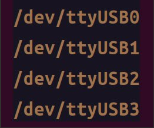
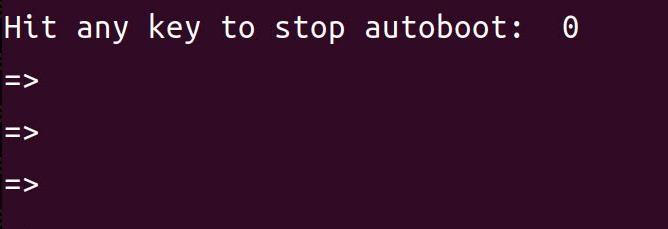
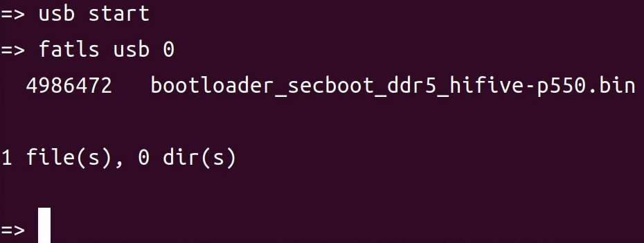
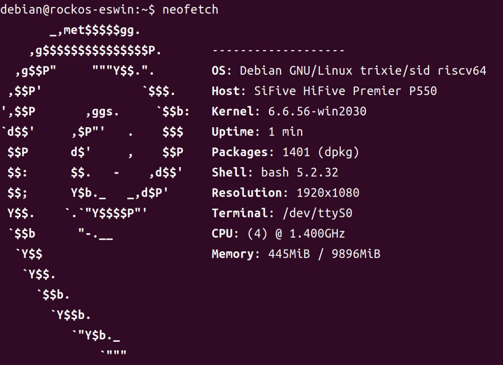

# RockOS 镜像刷写教程

## 演示环境

主机系统版本:Ubuntu22.04

minicom 版本:2.8

fastboot 版本：28.0.2-debian

## 准备工作

### 硬件准备

- USB Type A 转 USB Type C 线缆
- USB Type A 转 USB Type A 线缆
- 一个格式化为 FAT32 的 U 盘

### 镜像下载

- bootloader：[点击下载](https://mirror.iscas.ac.cn/rockos/extra/images/evb1/20241030/20241024/bootloader_secboot_ddr5_hifive-p550.bin)

- boot：[点击下载](https://mirror.iscas.ac.cn/rockos/extra/images/evb1/20241030/20241024/boot-eswin_evb-20241024-145708.ext4.zst)

- rootfs：[点击下载](https://mirror.iscas.ac.cn/rockos/extra/images/evb1/20241030/20241024/root-eswin_evb-20241024-145708.ext4.zst)

boot 及 rootfs 请下载后进行解压，bootloader 文件下载完成后请拷贝到已经格式化为 FAT32 的 U 盘中。

## 镜像刷写

请用 USB Type A 转 USB Type C 以及 USB Type A 转 USB Type A 将开发板与主机相连。

根据[官方手册](https://sifive.cdn.prismic.io/sifive/ZxLYXYF3NbkBXux1_HF106_user_guide_V1p0_zh_Final.pdf)中 3.1.6 部分的内容

USB Type A 转 USB Type A 将接入编号 10 双 USB Type-A 连接器中靠上的接口。

USB Type A 转 USB Type C 接入编号 15Type-C USB 连接器。

### bootloader

首先通过串口连接到开发板，在线缆正确接入开发板后，会列举为四个 UART。



根据[MCU 用户手册](https://www.sifive.cn/api/document-file?uid=premier-p550-mcu-user-manual)中 2.1.1.1 节的内容，我们在 minicom 中将 ttyUSB2 设置为连接路径，波特率设置为 115200。


```bash
sudo minicom -D /dev/ttyUSB2 -b 115200
```

插入准备好的含有 bootloader 文件的 U 盘。

按下电源键启动后，观察 minicom 窗口内，按任意键打断 U-Boot 加载。



执行下面的命令，查看 U 盘内的文件。

```bash
usb start

fatls usb 0 / # 如U盘内存在多个文件时请确认bootloader文件的存放路径
```



确认 U 盘内文件正确后执行下面命令

```bash
fatload usb 0 0x90000000 bootloader_secboot_ddr5_hifive-p550.bin

es_burn write 0x90000000 flash
```

重启后再次打断机器执行分区（第一次刷写必选，需要给分区足够大小容纳刷写 boot/root）

```bash
reset 
# 打断uboot启动
run gpt_partition 
```


### Boot&Rootfs

在启动并打断机器后输入以下命令进入 fastboot 状态 (需要提前拔掉 USB Type A 转 USB Type A 线缆，避免电路冲突或者通信冲突)

```bash
fastboot usb 0
```


在主机上另开一个终端，执行刷写命令

```bash
sudo fastboot flash boot boot-eswin_evb-20241024-145708.ext4 # 刷写boot
sudo fastboot flash root root-eswin_evb-20241024-145708.ext4 # 刷写rootfs
# 请注意文件路径 刷写时间大约在10分钟左右
```

返回 minicom 端口后按任意键取消 fastboot 状态，随后执行 reset 重启机器。

至此 rockOS 镜像刷写完成。


